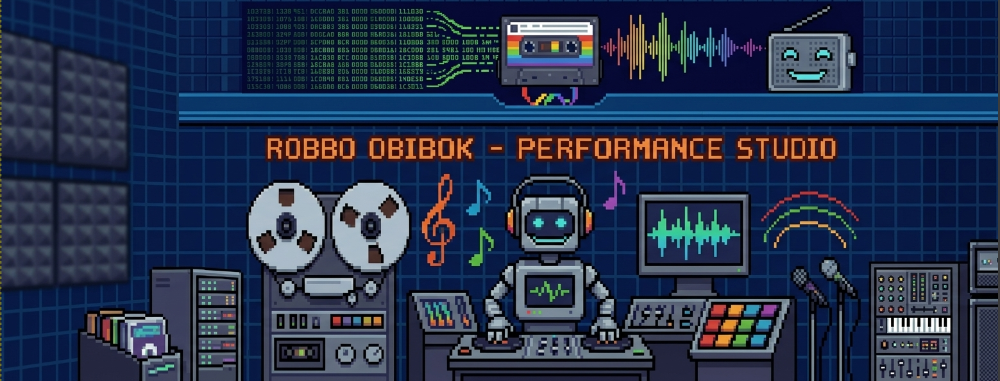

<p align="center">
  <pre>
    __________        ___.   ___.                ________  ___.    .__ ___.             __     
    \______   \  ____ \_ |__ \_ |__    ____      \_____  \ \_ |__  |__|\_ |__    ____  |  | __ 
     |       _/ /  _ \ | __ \ | __ \  /  _ \      /   |   \ | __ \ |  | | __ \  /  _ \ |  |/ / 
     |    |   \(  <_> )| \_\ \| \_\ \(  <_> )    /    |    \| \_\ \|  | | \_\ \(  <_> )|    <  
     |____|_  / \____/ |___  /|___  / \____/     \_______  /|___  /|__| |___  / \____/ |__|_ \ 
            \/             \/     \/                     \/     \/          \/              \/
  </pre>
</p>

<p align="center">
  
</p>

# Robbo Obibok — The Ultimate Chiptune Bot

Named after a fusion of the 1989 Polish Atari classic *Robbo* and the avant-garde jazz band *Robotobibok*, this specialized Discord bot streams vintage retro chipmusic. Blending intricate technical grooves with retro charm, Robbo plays from **eight collections** spanning Atari, C64, ZX Spectrum, Amiga, SNES, demoscene keygens, and beyond.

**Join a voice channel, type `!play`, and let the chips play.**

## Features

- 🎵 **Eight collections** — switch between ASMA (Atari SAP, 6 300+), HVSC (C64 SID, 60 000+), AY (ZX Spectrum, 4 500+), YM (Atari ST, 7 200+), ModArchive (Amiga/PC tracker modules, 175 000+), SNES SPC (RSN, ~2 600 game sets), Tiny Music modules (~550), and KGen (demoscene keygen music, 4 800+)
- 🔀 **Shuffle loop** — never hear the same track twice in a row
- 🎼 **Rich metadata** — track name, composer, copyright from headers
- ❤️ **Favorites playlist** — react to any Now Playing embed to save/remove tracks
- ⏭️ **Skip**, **Stop**, **Now Playing**, **Stats**, **Search**
- 🔄 **Auto-advance** — moves to next track when current ends, with GME-aware monitoring
- 💾 **Queue persistence** — saves/restores queue across restarts
- 📻 **Auto-start** — starts playing when someone joins a configured voice channel
- 🌙 **Auto-stop** — disconnects after channel is empty for a timeout
- 🏥 **Watchdog** — auto-restarts players and PulseAudio sink if they crash
- ⚙️ **Configurable** via `config.yaml`
- 📀 **Local archives** — all collections served from disk, no remote crawling at runtime

## Commands

| Command | Description |
|---------|-------------|
| **🎮 Playback** | |
| `!play` / `!pl` | Start shuffled radio from current collection |
| `!play <query>` | Search and play first matching track |
| `!play <number>` | Play a track from last search results |
| `!stop` / `!st` | Stop playback and disconnect |
| `!skip` / `!next` / `!nt` | Skip to next track |
| `!jump <n>` | Jump to track N in queue |
| `!np` | Show current track info |
| `!queue` / `!q` | Show upcoming tracks |
| `!history` | Show last 10 played tracks |
| `!sleep <min>` | Stop playback after N minutes |
| `!loop` | Toggle repeat current track |
| `!volume <0-200>` | Set playback volume |
| `!clear` | Clear the queue |
| **🎵 Collections** | |
| `!flip` / `!switch` / `!toggle` / `!fl` | Rotate through all available collections |
| `!status` / `!mode` / `!collection` | Show current collection and queue info |
| `!search <query>` | Search tracks by name, directory, or author |
| `!snes search <term>` | Search SNES collection by game/composer |
| `!hvsc` / `!c64` / `!sid` | Switch to **Commodore 64 SID** (~60 500) |
| `!asma` | Switch to **Atari SAP** (~6 300) |
| `!mod` / `!modarchive` / `!modules` | Switch to **ModArchive tracker modules** (~175 000) |
| `!ay` / `!spectrum` / `!zx` | Switch to **ZX Spectrum AY** (~4 500) |
| `!ym` / `!atarist` | Switch to **Atari ST YM** (~7 200) |
| `!tiny` / `!tm` | Switch to **Tiny Music modules** (~418) |
| `!snes` / `!spc` | Switch to **SNES SPC** (~60 000) |
| `!kgen` / `!keygen` / `!k` | Switch to **Keygen Music** (~4 800) |
| **❤️ Favorites & Blacklist** | |
| `!favorites` / `!favs` | Show your reaction-based favorites playlist |
| `!favplay` / `!fp` | Play favorites in shuffle mode |
| `!favsave` / `!pls` | Save current favorites as a named playlist |
| `!favload` / `!fpl` | Load and play a saved playlist |
| `!playlists` / `!plist` | List all saved playlists |
| `!blk` | Blacklist the currently playing track |
| `!blks` | Show blacklist |
| `!blkrm <n>` | Remove track N from blacklist |
| **🔧 Tools & Info** | |
| `!stats` | Show radio stats (uptime, tracks played) |
| `!export` | Export queue as plain text |
| `!ocko` | 🦉 Display an ASCII owl |
| `!refresh` | Re-crawl ASMA collection *(mods only)* |
| `!reindex` | Re-fetch metadata from files *(mods only)* |

### Favorites System

React with **any emoji** to a Now Playing embed to save the track to your favorites. React again to remove it (toggle). Data persists in `favorites.json`.

## Collections

| Collection | Format | Tracks | Source | 
|------------|--------|--------|--------|
| **ASMA** | `.sap` | 6 335 | Local `archiwum/asma/` |
| **HVSC** | `.sid` | 60 811 | Local `archiwum/hvsc/C64Music/` |
| **AY** | `.ay` | 4 550 | Local `archiwum/ay/` |
| **YM** | `.ym` | 7 266 | Local `archiwum/ym/` |
| **ModArchive** | `.mod`, `.xm`, `.s3m`, `.it` | 175 000+ | Online API + local cache `archiwum/modarchive/` |
| **SNES SPC** | `.spc` | 2 612 game sets | Local `archiwum/snes_spc/` (RSN mirror) |
| **Tiny Music** | `.mod`, `.xm`, `.s3m`, `.it` | 548 | Local `archiwum/tiny/` |
| **KGen** | `.mod`, `.xm`, `.s3m`, `.it` | 4 843 | Local `archiwum/kgen/` |

All archives are served from local disk — no external HTTP calls during playback.

## Quick Start

Supported Python versions: **3.11–3.13**.

### Ubuntu / Debian

```bash
sudo apt update
sudo apt install -y python3 python3-venv audacious audacious-plugins ffmpeg pipewire-pulse gstreamer1.0-plugins-good gstreamer1.0-plugins-bad sidplayfp

git clone git@github.com:wiiii653/robbo-obibok.git
cd robbo-obibok
make install
```

### Fedora

```bash
sudo dnf install -y python3 python3-virtualenv audacious audacious-plugins ffmpeg pipewire-utils gstreamer1-plugins-good gstreamer1-plugins-bad-free gstreamer1-plugins-bad-freeworld sidplayfp

git clone git@github.com:wiiii653/robbo-obibok.git
cd robbo-obibok
make install
```

### Arch Linux

```bash
sudo pacman -S python python-virtualenv audacious audacious-plugins ffmpeg pipewire gst-plugins-good gst-plugins-bad sidplayfp

git clone git@github.com:wiiii653/robbo-obibok.git
cd robbo-obibok
make install
```

## Running

```bash
cd robbo-obibok
source venv/bin/activate

# Set your bot token
export DISCORD_BOT_TOKEN="your-token-here"

# Run via the shared launcher
./run_bot.sh

# Run with strict compatibility mode
ROBBO_STRICT_COMPAT=1 ./run_bot.sh
```

Launcher test commands:

```bash
# Focused launcher smoke suite
./scripts/test_launchers.sh

# Equivalent Make target
make test-launchers
```

Development checks:

```bash
make test
make test-integration
```

Lock file management:

```bash
# Regenerate requirements.lock.txt after changing requirements*.txt
make requirements.lock.txt
```

The logged launcher, strict mode, and entrypoint smoke targets are also available — see `make help`.
Integration tests use the real Discord SDK and FFmpeg. Set `DISCORD_INTEGRATION_TOKEN`
to enable API authentication and `RUN_LIVE_AUDIO_INTEGRATION=1` to check local
PulseAudio/Audacious services.

Logged launcher path:

```bash
# Canonical logged launcher module
PYTHONPATH=src ./venv/bin/python3 -u -m robbo_obibok.robbo_obibok_logged_launcher
```

> **Note for C64 SID playback:** GStreamer `siddec` plugin is bundled with `gstreamer1.0-plugins-bad`. If SIDs don't play, verify with: `gst-inspect-1.0 siddec`

## Invite the Bot

1. Go to [Discord Developer Portal](https://discord.com/developers/applications)
2. Select your bot application → **OAuth2 → URL Generator**
3. Scopes: `bot`, `applications.commands`
4. Permissions: `Send Messages`, `Connect`, `Speak`, `Use Voice Activity`
5. Use the generated URL to invite the bot to your server

## Systemd Service (Linux)

Run as a background service:

```bash
# Copy a service file
mkdir -p ~/.config/systemd/user
cp deploy/robbo-obibok.service ~/.config/systemd/user/
# or
cp deploy/robbo-obibok-strict.service ~/.config/systemd/user/

# Store token in the environment file used by the service
printf 'DISCORD_BOT_TOKEN="%s"\n' "YOUR_TOKEN_HERE" > ~/robbo-obibok/.env
chmod 600 ~/robbo-obibok/.env

# Enable and start
systemctl --user daemon-reload
systemctl --user enable robbo-obibok
systemctl --user start robbo-obibok

# Or use the strict service explicitly
systemctl --user enable robbo-obibok-strict
systemctl --user start robbo-obibok-strict

# Check logs
journalctl --user -u robbo-obibok -f
```

## Building Local Indexes

After cloning, build the local track indexes for the local archive collections:

```bash
make build-indexes

# or run the builders directly
python scripts/build_asma_index.py   # indexes all .sap files in archiwum/asma/
python scripts/build_hvsc_index.py   # indexes all .sid files in archiwum/hvsc/C64Music/
python scripts/build_ay_index.py     # indexes all .ay files in archiwum/ay/
python scripts/build_ym_index.py     # indexes all .ym files in archiwum/ym/
python scripts/build_tiny_index.py   # indexes all tiny-module files in archiwum/tiny/
python scripts/build_snes_index.py   # indexes all .spc files in archiwum/snes_spc/
# KGen uses a static archive — index is built from keygen-music pack metadata
```

These generate `*_cache_local.json` files for instant startup — no crawling at runtime.

## Audio Effects

The bot enables Audacious's **Compressor** effect plugin at startup for consistent loudness across collections (particularly important when switching between SID, SAP, MOD, and other formats with differing volume levels).

The compressor is configured via Audacious's user config (`~/.config/audacious/config`):
```ini
[compressor]
center=0.4
range=0.35
```

To verify the compressor is active: `audtool plugin-is-enabled compressor`
To adjust the settings: edit `~/.config/audacious/config` and restart the bot.

## Troubleshooting

| Symptom | Likely Fix |
|---------|-----------|
| `RuntimeError: PyNaCl library needed` | `pip install pynacl` |
| Bot doesn't respond to commands | Enable **Message Content Intent** in Discord Developer Portal |
| Bot joins VC but no sound (SAP) | Audacious not running — restart bot, or run `audacious --headless` manually |
| Bot joins VC but no sound (SID/AY/YM) | `gst-inspect-1.0 siddec` — if missing, install `gstreamer1.0-plugins-bad` |
| Two collections play at once | Update to latest code — `stop_all_players()` fix prevents audio bleed |
| Crawl seems stuck | All collections are local now — run build scripts if cache is missing |
| `!play` says "Join a voice channel" | You must be on a voice channel when issuing the command |
| Bot auto-disconnects too fast | Increase `auto.empty_timeout` in config |
| SID metadata is empty | Some SID files lack embedded headers — filename is shown as fallback |
| GME formats skip too early | Updated in latest code — GME formats use 600s timeout with song-loaded check |
| Temp dir cleanup errors | Temp dir moved under `var/tmp/` in bot root — no more `/tmp/asma_bot_*` orphaned dirs |
| Audio is too quiet or uneven | Compressor plugin is enabled at startup — verify with `audtool plugin-is-enabled compressor` |

## Configuration

Edit `config.yaml`:

```yaml
command_prefix: "!"
# Recommended: fixes the process-global audio backend to one server.
guild_id: 123456789012345678
asma:
  base_url: "https://asma.atari.org/asma/"
  top_dirs:
    - "Composers/"
    - "Games/"
    - "Groups/"
    - "Misc/"
    - "Unknown/"
  crawl_timeout: 15
  cache_ttl: 24
hvsc:
  base_url: "https://www.hvsc.c64.org/download/C64Music/"
  songlengths_url: "https://www.hvsc.c64.org/download/C64Music/DOCUMENTS/Songlengths.txt"
  cache_ttl: 168
  enabled: false
ay:
  base_url: "https://web.archive.org/web/2023/ayarchive/..."
  cache_ttl: 168
ym:
  base_url: "https://...ym archive..."
  cache_ttl: 168
modarchive:
  base_url: "https://api.modarchive.org/"
  cache_ttl: 168
snes:
  base_url: "https://...rsn mirror..."
  cache_ttl: 168
audio:
  sink_name: "robbo_bot"
  sample_rate: 48000
  channels: 2
  format: "s16le"
playback:
  loop: true
  shuffle: true
  crossfade: 0
auto:
  start_channel: ""
  empty_timeout: 60
```

Configuration is validated during startup. Invalid types, negative timeouts, unsafe
sink names, and malformed YAML stop startup with a field-specific error.

The audio backend uses one Audacious process and one PulseAudio sink. When `guild_id`
is configured, commands and auto-start are restricted to that server. Without it,
the first server to issue a command owns the process until restart, and auto-start is
disabled to prevent multiple servers from sharing the global player.

## File Structure

```
robbo-obibok/
├── robbo-obibok.py            # Default launcher facade
├── robbo-obibok-strict.py     # Strict launcher facade
├── src/                       # Python source modules
│   ├── robbo_obibok_runtime.py    # Importable runtime facade
│   ├── robbo_obibok_launcher.py   # Shared process launcher
│   ├── robbo_obibok_logged_launcher.py # Logging-oriented launcher
│   ├── domain_*.py             # Pure data models
│   ├── entrypoint_*.py         # DI / composition root
│   ├── playback_*.py           # Playback logic
│   ├── runtime_*.py            # Runtime wiring
│   ├── bot_*.py                # Discord bot runtime
│   ├── archive_*.py            # Archive abstraction
│   ├── collection_*.py         # Collection specs
│   └── ...                     # source files (see AGENTS.md for layer map)
├── scripts/                   # Build and utility scripts
│   ├── build_*_index.py       # Local index builders
│   ├── install.sh             # Installation script
│   └── test_launchers.sh      # Launcher smoke test runner
├── docs/                      # Documentation
│   └── MAINTAINABILITY_PLAN.md
├── config.yaml                # Configuration file
├── requirements.txt           # Python dependencies
├── requirements.lock.txt      # Locked dependencies
├── README.md                  # This file
├── .gitignore                 # Git ignore rules
├── Makefile                   # Build/test commands
├── extras/                    # Assets (robbo-banner.png)
├── var/                       # Runtime data (queues, playlists, temp, logs)
│   ├── queues/                # Persisted queues per guild (generated)
│   ├── playlists/             # Saved playlists (generated)
│   └── tmp/                   # Temp directory for subsong WAVs (generated)
├── archiwum/                  # Local archives (see Collections table)
│   ├── asma/                  # Atari SAP files
│   ├── hvsc/                  # C64 SID files
│   ├── ay/                    # ZX Spectrum AY files
│   ├── ym/                    # Atari ST YM files
│   ├── tiny/                  # Tiny Music modules
│   ├── kgen/                  # Keygen Music modules
│   ├── snes_spc/              # SNES SPC files
│   └── modarchive/            # ModArchive tracker modules + cache
├── favorites.json             # Reaction-based favorites (generated)
├── *_cache_local.json         # Local track indexes (generated)
└── *.cache.json               # Other collection cache files (generated)
```
